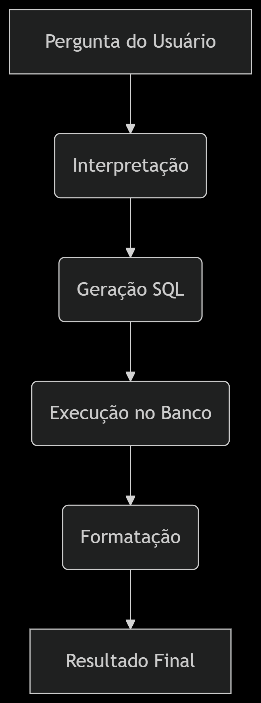

# Desafio Técnico - Automação com IA e Análise Operacional

## 🚀 Instruções de Execução
1. Instale as dependências:
```bash
pip install -r requirements.txt

streamlit run app.py

Fluxo dos agentes:


