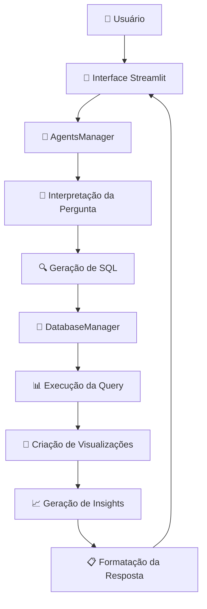

# 📊 Analytics com IA - Sistema Completo de Análise de Dados

Um sistema inteligente de análise de dados que utiliza agentes de IA para interpretar perguntas em linguagem natural e gerar automaticamente consultas SQL, visualizações e insights analíticos.

## 🚀 Características Principais

- **Interpretação em Linguagem Natural**: Faça perguntas em português sobre seus dados
- **Geração Automática de SQL**: Converte automaticamente suas perguntas em queries SQL válidas
- **Múltiplos Formatos de Saída**: Tabelas, gráficos interativos ou resumos textuais
- **Visualizações Inteligentes**: Gráficos matplotlib e plotly gerados automaticamente
- **Insights com IA**: Análises elaboradas e recomendações baseadas nos dados
- **Interface Web Intuitiva**: Dashboard completo desenvolvido em Streamlit

## 🏗️ Arquitetura do Sistema

### Fluxo dos Agentes



### Componentes Principais

#### 1. **AgentsManager** (`src/agents.py`)
Núcleo do sistema que coordena todos os agentes:

- **Agente de Interpretação**: Analisa perguntas em linguagem natural
- **Agente SQL**: Gera queries SQL otimizadas
- **Agente de Visualização**: Cria gráficos matplotlib e plotly
- **Agente de Insights**: Produz análises textuais elaboradas

#### 2. **DatabaseManager** (`src/database.py`)
Gerenciador robusto de conexões e operações com SQLite:

- Execução segura de queries
- Validação de dados
- Health checks do banco
- Gestão de conexões

#### 3. **Sistema de Prompts** (`src/prompts.py`)
Templates otimizados para diferentes tipos de análise:

- `INTERPRETATION_PROMPT`: Interpreta solicitações do usuário
- `SQL_PROMPT`: Gera SQL válido
- `FORMATTING_PROMPT`: Formata respostas
- `ERROR_PROMPT`: Trata erros de forma amigável

## 📦 Estrutura do Projeto

```
data-analysis-ai/
├── src/
│   ├── agents.py              # Gerenciador de agentes IA
│   ├── database.py            # Gerenciador de banco de dados
│   ├── prompts.py             # Templates de prompts
│   └── utils.py               # Utilitários
├── data/
│   └── clientes_completo.db   # Banco de dados SQLite
├── docs/
│   └── relatorio_insights.md  # Relatório de insights
├── pngs/
│   └── outputs/               # Imagens geradas
├── app.py                     # Aplicação Streamlit principal
├── requirements.txt           # Dependências Python
├── .env                       # Variáveis de ambiente
├── .gitignore                 # Arquivos ignorados pelo Git
└── README.md                  # Este arquivo
```

## 🗄️ Schema do Banco de Dados

O sistema trabalha com 4 tabelas principais:

### 1. **clientes**
```sql
CREATE TABLE clientes (
    id INTEGER PRIMARY KEY,
    nome TEXT,
    email TEXT,
    idade INTEGER,
    cidade TEXT,
    estado TEXT,
    profissao TEXT,
    genero TEXT
);
```

### 2. **compras**
```sql
CREATE TABLE compras (
    id INTEGER PRIMARY KEY,
    cliente_id INTEGER,
    data_compra TEXT,  -- Formato ISO: YYYY-MM-DD
    valor REAL,
    categoria TEXT,
    canal TEXT,
    FOREIGN KEY (cliente_id) REFERENCES clientes(id)
);
```

### 3. **suporte**
```sql
CREATE TABLE suporte (
    id INTEGER PRIMARY KEY,
    cliente_id INTEGER,
    data_contato TEXT,  -- Formato ISO: YYYY-MM-DD
    tipo_contato TEXT,
    resolvido BOOLEAN,
    canal TEXT,
    FOREIGN KEY (cliente_id) REFERENCES clientes(id)
);
```

### 4. **campanhas_marketing**
```sql
CREATE TABLE campanhas_marketing (
    id INTEGER PRIMARY KEY,
    cliente_id INTEGER,
    nome_campanha TEXT,
    data_envio TEXT,    -- Formato ISO: YYYY-MM-DD
    interagiu BOOLEAN,
    canal TEXT,
    FOREIGN KEY (cliente_id) REFERENCES clientes(id)
);
```

## 🛠️ Instalação e Configuração

### Pré-requisitos

- Python 3.8+
- Chave da API OpenAI
- SQLite (já incluído no Python)

### 1. Clone o Repositório

```bash
git clone https://github.com/Filip3Owl/data-analysis-ai.git
cd data-analysis-ai
```

### 2. Crie um Ambiente Virtual

```bash
python -m venv venv
source venv/bin/activate  # Linux/Mac
# ou
venv\Scripts\activate     # Windows
```

### 3. Instale as Dependências

```bash
pip install -r requirements.txt
```

### 4. Configure as Variáveis de Ambiente

Crie um arquivo `.env` na raiz do projeto:

```env
OPENAI_API_KEY=sk-sua_chave_openai_aqui
```

### 5. Execute a Aplicação

```bash
streamlit run app.py
```

A aplicação estará disponível em `http://localhost:8501`

## 📋 Dependências

```txt
streamlit>=1.28.0
pandas>=2.0.0
matplotlib>=3.7.0
seaborn>=0.12.0
plotly>=5.15.0
numpy>=1.24.0
langchain>=0.0.300
openai>=0.28.0
python-dotenv>=1.0.0
sqlite3  # Incluído no Python padrão
pathlib  # Incluído no Python padrão
```

## 🎯 Como Usar

### 1. **Acesse a Interface**
Abra `http://localhost:8501` no seu navegador

### 2. **Configure sua Chave OpenAI**
Na barra lateral, insira sua chave da API OpenAI

### 3. **Faça Perguntas em Linguagem Natural**

Exemplos de perguntas que você pode fazer:

#### 📊 **Análises de Ranking**
- "Mostre os 10 clientes que mais compraram"
- "Top 5 estados com maior volume de vendas"
- "Quais são as categorias de produtos mais vendidas?"

#### 📈 **Análises de Tendência**
- "Evolução das vendas por mês em 2024"
- "Tendência de contatos de suporte ao longo do tempo"
- "Como está a performance das campanhas de marketing?"

#### 🥧 **Análises de Distribuição**
- "Distribuição de clientes por estado"
- "Participação de cada canal de vendas"
- "Proporção de tickets de suporte resolvidos"

#### 📋 **Consultas Específicas**
- "Clientes do Rio Grande do Sul que compraram via app"
- "Vendas de eletrônicos no primeiro semestre"
- "Taxa de interação das campanhas por canal"

### 4. **Escolha o Formato de Saída**

- **📋 Tabela**: Para dados detalhados e exportação
- **📊 Gráfico**: Para visualizações interativas
- **📝 Texto**: Para resumos e insights

### 5. **Configure Opções Avançadas**

- **Tipo de Gráfico**: Barras, Linhas, Pizza, Área, Dispersão
- **Limite de Registros**: 10 a 10.000 registros
- **Ordenação**: Por qualquer coluna, crescente ou decrescente

## 🧠 Funcionalidades Inteligentes

### Interpretação Automática
O sistema identifica automaticamente:
- **Tipo de análise**: Ranking, distribuição, tendência, comparação
- **Tabelas necessárias**: Baseado no contexto da pergunta
- **Filtros relevantes**: Datas, categorias, valores
- **Métricas apropriadas**: COUNT, SUM, AVG, etc.
- **Tipo de visualização**: Gráfico mais adequado para os dados

### Geração de SQL Inteligente
- **JOINs automáticos**: Entre tabelas relacionadas
- **Formatação de datas**: Usando `strftime` para SQLite
- **Aliases descritivos**: Para melhor legibilidade
- **Validação de queries**: Antes da execução
- **Otimização automática**: Para melhor performance

### Insights com IA
O sistema gera automaticamente:
- **Principais descobertas**: Dos dados analisados
- **Tendências identificadas**: Padrões nos dados
- **Insights de negócio**: Relevantes para tomada de decisão
- **Recomendações**: Baseadas nos resultados
- **Análise de outliers**: Valores atípicos
- **Estatísticas descritivas**: Médias, totais, variabilidade

## 📊 Tipos de Visualização

### Gráficos Matplotlib
- Estilo otimizado para apresentações
- Cores harmoniosas
- Anotações automáticas de valores
- Formatação responsiva

### Gráficos Plotly
- Interatividade completa
- Zoom, pan, hover
- Exportação em diversos formatos
- Animações suaves

### Tabelas Inteligentes
- Formatação automática de valores monetários
- Ordenação por qualquer coluna
- Paginação otimizada
- Exportação em CSV

## 🔧 Configurações Avançadas

### Personalização de Prompts
Edite `src/prompts.py` para:
- Adaptar para seu domínio específico
- Incluir novos tipos de análise
- Melhorar a precisão das interpretações

### Extensão do Schema
Para adicionar novas tabelas:
1. Atualize o schema em `src/prompts.py`
2. Modifique o `AgentsManager` se necessário
3. Teste com queries simples primeiro

### Otimização de Performance
- Ajuste o `record_limit` para datasets grandes
- Use índices no banco SQLite
- Configure cache para queries frequentes

## 🚨 Tratamento de Erros

O sistema inclui tratamento robusto de erros:

- **Queries inválidas**: Mensagens claras e sugestões
- **Dados não encontrados**: Diagnóstico automático
- **Falhas de conexão**: Retry automático
- **Erros de IA**: Fallback para métodos tradicionais

## 🔒 Segurança

- **Validação de SQL**: Previne injection attacks
- **Sanitização de inputs**: Limpeza automática
- **Chaves de API**: Armazenamento seguro
- **Logs de auditoria**: Para monitoramento

## 📈 Métricas e Monitoramento

O sistema oferece:
- **Health checks**: Status do banco em tempo real
- **Métricas de usage**: Queries executadas
- **Performance tracking**: Tempos de resposta
- **Error rates**: Taxa de falhas

## 🤝 Contribuição

1. Fork o projeto
2. Crie uma branch para sua feature (`git checkout -b feature/AmazingFeature`)
3. Commit suas mudanças (`git commit -m 'Add some AmazingFeature'`)
4. Push para a branch (`git push origin feature/AmazingFeature`)
5. Abra um Pull Request

## 📝 Roadmap

### Próximas Funcionalidades
- [ ] Suporte a PostgreSQL e MySQL
- [ ] Dashboard de administração
- [ ] APIs REST para integração
- [ ] Cache inteligente de queries
- [ ] Exportação para PowerBI/Tableau
- [ ] Alertas automáticos
- [ ] Análise preditiva com ML

### Melhorias Planejadas
- [ ] Interface mobile responsiva
- [ ] Suporte a múltiplos idiomas
- [ ] Temas customizáveis
- [ ] Integração com Slack/Teams
- [ ] Scheduled reports
- [ ] Data governance

## 📄 Licença

Este projeto está licenciado sob a Licença MIT - veja o arquivo [LICENSE](LICENSE) para detalhes.

## 👨‍💻 Autor

**Filipe Rangel**
- GitHub: [@Filip3Owl](https://github.com/Filip3Owl)
- LinkedIn: [Filipe Rangel](https://www.linkedin.com/in/filiperangelambrosio/)

## 🙏 Agradecimentos

- Franq OpenBank pela excelente desafio
- Streamlit pela excelente framework
- Plotly pelos gráficos interativos
- Comunidade Python pelo suporte

---

⭐ **Se este projeto foi útil para você, deixe uma estrela!** ⭐
