Aqui está a tradução completa para o inglês do seu README:

---

# 📊 AI-Powered Analytics – Complete Data Analysis System

An intelligent data analysis system that uses AI agents to interpret natural language questions and automatically generate SQL queries, visualizations, and analytical insights.

## 🚀 Key Features

* **Natural Language Interpretation**: Ask questions in Portuguese about your data
* **Automatic SQL Generation**: Converts your questions into valid SQL queries
* **Multiple Output Formats**: Tables, interactive charts, or textual summaries
* **Smart Visualizations**: Automatically generated matplotlib and Plotly charts
* **AI-Generated Insights**: Analytical summaries and recommendations
* **Intuitive Web Interface**: Full-featured dashboard built with Streamlit

## 🏗️ System Architecture

### Agent Flow

```mermaid
graph TD
    A[👤 User] --> B[🎯 Streamlit Interface]
    B --> C[🧠 AgentsManager]
    C --> D[📝 Question Interpretation]
    D --> E[🔍 SQL Generation]
    E --> F[💾 DatabaseManager]
    F --> G[📊 Query Execution]
    G --> H[🎨 Visualization Creation]
    H --> I[📈 Insight Generation]
    I --> J[📋 Response Formatting]
    J --> B
```



### Main Components

#### 1. **AgentsManager** (`src/agents.py`)

The system’s core that orchestrates all agents:

* **Interpretation Agent**: Understands natural language questions
* **SQL Agent**: Generates optimized SQL queries
* **Visualization Agent**: Creates matplotlib and Plotly charts
* **Insight Agent**: Produces detailed textual analysis

#### 2. **DatabaseManager** (`src/database.py`)

Robust SQLite connection and operation manager:

* Safe query execution
* Data validation
* Database health checks
* Connection management

#### 3. **Prompt System** (`src/prompts.py`)

Optimized templates for different analysis types:

* `INTERPRETATION_PROMPT`: Interprets user requests
* `SQL_PROMPT`: Generates valid SQL
* `FORMATTING_PROMPT`: Formats responses
* `ERROR_PROMPT`: Handles errors gracefully

## 📦 Project Structure

```
data-analysis-ai/
├── src/
│   ├── agents.py              # AI agent manager
│   ├── database.py            # Database manager
│   ├── prompts.py             # Prompt templates
│   └── utils.py               # Utilities
├── data/
│   └── clientes_completo.db   # SQLite database
├── docs/
│   └── relatorio_insights.md  # Insights report
├── pngs/
│   └── outputs/               # Generated images
├── app.py                     # Main Streamlit app
├── requirements.txt           # Python dependencies
├── .env                       # Environment variables
├── .gitignore                 # Git ignored files
└── README.md                  # This file
```

## 🗄️ Database Schema

The system works with 4 main tables:

### 1. **clientes**

```sql
CREATE TABLE clientes (
    id INTEGER PRIMARY KEY,
    nome TEXT,
    email TEXT,
    idade INTEGER,
    cidade TEXT,
    estado TEXT,
    profissao TEXT,
    genero TEXT
);
```

### 2. **compras**

```sql
CREATE TABLE compras (
    id INTEGER PRIMARY KEY,
    cliente_id INTEGER,
    data_compra TEXT,
    valor REAL,
    categoria TEXT,
    canal TEXT,
    FOREIGN KEY (cliente_id) REFERENCES clientes(id)
);
```

### 3. **suporte**

```sql
CREATE TABLE suporte (
    id INTEGER PRIMARY KEY,
    cliente_id INTEGER,
    data_contato TEXT,
    tipo_contato TEXT,
    resolvido BOOLEAN,
    canal TEXT,
    FOREIGN KEY (cliente_id) REFERENCES clientes(id)
);
```

### 4. **campanhas\_marketing**

```sql
CREATE TABLE campanhas_marketing (
    id INTEGER PRIMARY KEY,
    cliente_id INTEGER,
    nome_campanha TEXT,
    data_envio TEXT,
    interagiu BOOLEAN,
    canal TEXT,
    FOREIGN KEY (cliente_id) REFERENCES clientes(id)
);
```

## 🛠️ Installation & Setup

### Requirements

* Python 3.8+
* OpenAI API key
* SQLite (bundled with Python)

### 1. Clone the Repository

```bash
git clone https://github.com/Filip3Owl/data-analysis-ai.git
cd data-analysis-ai
```

### 2. Create a Virtual Environment

```bash
python -m venv venv
source venv/bin/activate  # Linux/Mac
# or
venv\Scripts\activate     # Windows
```

### 3. Install Dependencies

```bash
pip install -r requirements.txt
```

### 4. Set Up Environment Variables

Create a `.env` file in the project root:

```env
OPENAI_API_KEY=sk-your_openai_key_here
```

### 5. Run the Application

```bash
streamlit run app.py
```

Access the app at `http://localhost:8501`

## 📋 Dependencies

```txt
streamlit>=1.28.0
pandas>=2.0.0
matplotlib>=3.7.0
seaborn>=0.12.0
plotly>=5.15.0
numpy>=1.24.0
langchain>=0.0.300
openai>=0.28.0
python-dotenv>=1.0.0
sqlite3  # Bundled with Python
pathlib  # Bundled with Python
```

## 🎯 How to Use

### 1. **Access the Interface**

Open `http://localhost:8501` in your browser

### 2. **Enter Your OpenAI API Key**

Use the sidebar to insert your key

### 3. **Ask Natural Language Questions**

Example queries:

#### 📊 **Ranking Analysis**

* "Show the top 10 clients by purchase volume"
* "Top 5 states with highest sales"
* "What are the best-selling product categories?"

#### 📈 **Trend Analysis**

* "Monthly sales trend in 2024"
* "Support contact trends over time"
* "How are the marketing campaigns performing?"

#### 🥧 **Distribution Analysis**

* "Client distribution by state"
* "Sales channel shares"
* "Proportion of resolved support tickets"

#### 📋 **Specific Queries**

* "Clients from Rio Grande do Sul who purchased via app"
* "Electronics sales in the first half of the year"
* "Campaign interaction rate by channel"

### 4. **Choose Output Format**

* **📋 Table**: For detailed data and export
* **📊 Chart**: For interactive visualizations
* **📝 Text**: For summaries and insights

### 5. **Configure Advanced Options**

* **Chart Type**: Bar, Line, Pie, Area, Scatter
* **Record Limit**: 10 to 10,000 rows
* **Sorting**: By any column, ascending or descending

## 🧠 Intelligent Features

### Automatic Interpretation

The system automatically identifies:

* **Type of analysis**: Ranking, distribution, trend, comparison
* **Relevant tables**: Based on context
* **Filters**: Dates, categories, values
* **Metrics**: COUNT, SUM, AVG, etc.
* **Visualization type**: Best suited for the data

### Smart SQL Generation

* **Automatic JOINs**: Between related tables
* **Date formatting**: Using `strftime` in SQLite
* **Descriptive aliases**: For readability
* **Query validation**: Before execution
* **Auto optimization**: For performance

### AI-Powered Insights

The system automatically produces:

* **Key findings**: From the analysis
* **Detected trends**: Patterns in the data
* **Business insights**: Actionable recommendations
* **Outlier analysis**: Detect unusual values
* **Descriptive stats**: Averages, totals, variation

## 📊 Visualization Types

### Matplotlib Charts

* Presentation-ready style
* Harmonious colors
* Auto-labeled values
* Responsive layout

### Plotly Charts

* Full interactivity
* Zoom, pan, hover
* Multi-format export
* Smooth animations

### Smart Tables

* Auto-formatting for currency
* Sortable columns
* Optimized pagination
* CSV export

## 🔧 Advanced Configuration

### Prompt Customization

Edit `src/prompts.py` to:

* Adapt to your domain
* Add new analysis types
* Improve interpretation accuracy

### Schema Extension

To add new tables:

1. Update schema in `src/prompts.py`
2. Modify `AgentsManager` if needed
3. Test with simple queries first

### Performance Optimization

* Adjust `record_limit` for large datasets
* Use indexes in SQLite
* Enable caching for frequent queries

## 🚨 Error Handling

The system includes robust error handling:

* **Invalid queries**: Clear messages and suggestions
* **No data found**: Auto diagnosis
* **Connection failures**: Auto retries
* **AI errors**: Fallback to traditional methods

## 🔒 Security

* **SQL validation**: Prevents injection attacks
* **Input sanitization**: Auto-cleaning
* **API key protection**: Stored securely
* **Audit logs**: For monitoring

## 📈 Metrics & Monitoring

The system provides:

* **Health checks**: Real-time DB status
* **Usage metrics**: Executed queries
* **Performance tracking**: Response times
* **Error rates**: Failure tracking

## 🤝 Contributing

1. Fork the project
2. Create a feature branch (`git checkout -b feature/AmazingFeature`)
3. Commit your changes (`git commit -m 'Add some AmazingFeature'`)
4. Push to the branch (`git push origin feature/AmazingFeature`)
5. Open a Pull Request

## 📝 Roadmap

### Upcoming Features

* [ ] PostgreSQL and MySQL support
* [ ] Admin dashboard
* [ ] REST APIs for integration
* [ ] Smart query caching
* [ ] PowerBI/Tableau export
* [ ] Automated alerts
* [ ] Predictive analysis with ML

### Planned Improvements

* [ ] Responsive mobile UI
* [ ] Multilingual support
* [ ] Custom themes
* [ ] Scheduled reports
* [ ] Data governance tools

## 📄 License

This project is licensed under the MIT License – see [LICENSE](LICENSE) for details.

## 👨‍💻 Author

**Filipe Rangel**

* GitHub: [@Filip3Owl](https://github.com/Filip3Owl)
* LinkedIn: [Filipe Rangel](https://www.linkedin.com/in/filiperangelambrosio/)

## 🙏 Acknowledgements

* Franq OpenBank for the great challenge
* Streamlit for the powerful framework
* Plotly for the interactive charts
* Python community for continuous support

---

Se quiser, posso te ajudar com versão em PDF, publicação no LinkedIn, e até sugestões para divulgação. Deseja isso?
